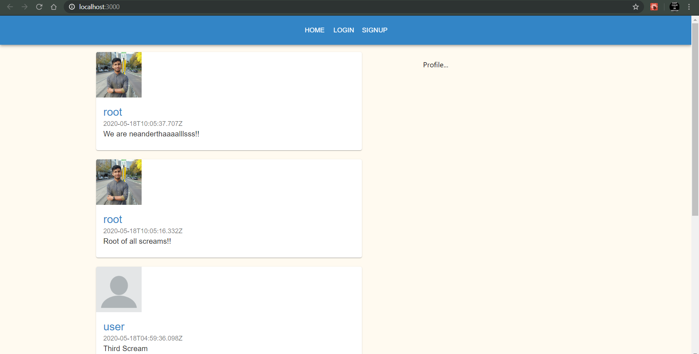

# Social-Neanderthals-App
A social media web application similar to Twitter, but customized for neanderthals.

The project is essentially a remodelled version of Ahmed Hadjou's [social-ape-app](https://github.com/hidjou), but built completely from the ground up, by following the latest documentation and using newer components, functions, and guidelines (e.g. React Hooks).

A work in progress by **Gazi Mufti Mahmood**

### Components used till now
**Backend**
- Node.js
- Google Firebase: Firestore (NoSQL) 
- Express
- Busboy

**Frontend**
- React
- Material UI
- React Router DOM
- Day.js

### More Documnetaion Coming Soon...
\
\
***Current Frontend***\
\
[More images](/images/)

## Acknowledgments

Documentation and tutorials from [FreeCodeCamp](https://www.freecodecamp.org/learn/) and [Ahmed Hadjou](https://www.youtube.com/channel/UC2-slOJImuSc20Drbf88qvg) were primarily used in the making of this appilcation.\
It is also highly emphasised to check the documentation for each component as they are being constantly developed and a number of things now differ form the two primary documnetations.
